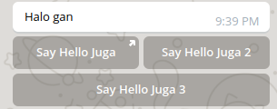
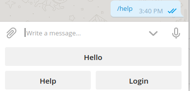

# LaravelTelegramBot

Laravel 6 package to manage Telegram Bot

## Preparation
- Create your own bot on [BotFather](https://t.me/botfather)
- Copy your bot key to your .env
> TELEGRAM_BOT_KEY=1234567890:Your-Bot-Key
- Run `php artisan config:clear`

## Installation

Via Composer

``` bash
$ composer require miqdadyyy/laraveltelegrambot
```

## Usage

### Methods
#### Get Bot ID
This method is used for get your bot identity 
```php
$result = LaravelTelegramBot::getId()
```
Request Parameter : -  

Response : 
```json
{
  "ok": true,
  "result": {
    "id": 123456789,
    "is_bot": true,
    "first_name": "MyExampleBot",
    "username": "my_example_bot",
    "can_join_groups": false,
    "can_read_all_group_messages": false,
    "supports_inline_queries": false
  }
}
```

#### Get Updates
This method is used for get all of your bot updates. Bot update is message or callback from user to your bot
```php
$result = LaravelTelegramBot::getUpdates()
```
Request Parameter : -    

Response : 
```json
{
  "ok": true,
  "result": [
    {
      "update_id": 123456789,
      "message": {
        "message_id": 1,
        "from": {
          "id": 123456789,
          "is_bot": false,
          "first_name": "Miqdad",
          "last_name": "Farcha",
          "username": "miqdadyyy"
        },
        "chat": {
          "id": 123456789,
          "first_name": "Miqdad",
          "last_name": "Farcha",
          "username": "miqdadyyy",
          "type": "private"
        },
        "date": 1581514530,
        "text": "/start",
        "entities": [
          {
            "offset": 0,
            "length": 6,
            "type": "bot_command"
          }
        ]
      }
    },
    {
      "update_id": 123456789,
      "message": {
        "message_id": 2,
        "from": {
          "id": 12345678,
          "is_bot": false,
          "first_name": "Miqdad",
          "last_name": "Farcha",
          "username": "miqdadyyy",
          "language_code": "en"
        },
        "chat": {
          "id": 12345678,
          "first_name": "Miqdad",
          "last_name": "Farcha",
          "username": "miqdadyyy",
          "type": "private"
        },
        "date": 1581514536,
        "text": "/id",
        "entities": [
          {
            "offset": 0,
            "length": 3,
            "type": "bot_command"
          }
        ]
      }
    }
  ]
}
```  

#### Create Message
You can create a message to send a user by `chat_id`.
```php
$message = LaravelTelegramBot::createMessage($chat_id, $text, $options);
```

- `$chat_id` : your client telegram ID (string)
- `$text` : message to your client (string)
- `$options` : a several options to send message (array)

Here is several options available for telegram bot
  
| No |          Option          |                                  Description                                 |         Value        |  
|----|--------------------------|------------------------------------------------------------------------------|----------------------|  
| 1  | parse_mode               | You can parse your message into HTML or Markdown                             | 'html' or 'markdown' |  
| 2  | disable_web_page_preview | Disables link previews for links in this message                             | true or false        |  
| 3  | disable_notification     | Sends the message silently. Users will receive a notification with no sound. | true or false        |  
| 4  | reply_to_message_id      | If the message is a reply, ID of the original message                        | Integer              |  
| 5  | reply_markup             | Additional interface options, we already make method for this                | array                |

After creating message with several options, if you want to send the message you should add : 
```php
$message->send();
```  

When you want to send message directly, you can use
```php
LaravelTelegramBot::sendMessage($chat_id, $text, $options);
```

#### Inline Keyboard
This object represents one button of an inline keyboard.
    
Example :  



To create Inline Keyboard : 
```php
$inline_keyboard = new InlineKeyboard();
```

To add lines to the keyboard
```php
$row1 = new InlineKeyboardRow();
$inline_keyboard->addRow($row);
``` 

But you need to add button each row
```php
$row->addButton($title, $callback);
```

There are 2 types inline keyboard button in this package (URL and callback), you can pass a `query_callback` or a `url` to callback parameters


The complete code to make button like example are :
```php
$inline_keyboard = new InlineKeyboard(); // create inline keyboard

$row1 = new InlineKeyboardRow(); // create first row
$row1->addButton('Say Hello Juga', 'http://www.example.com'); // add first button on first row
$row1->addButton('Say Hello Juga 2', 'callback_query'); // add second button on first row
$inline_keyboard->addRow($row); // add row to inline keyboard

// There are a method to add a single button to inline keyboard
$inline_keyboard->addSingleLineButton('Say Hello Juga 3', 'i dont know what');

// then add keyboard to a message
$message->addInlineKeyboard($inline_keyboard);
$message->send(); // send message to user
```  

if you want to add a single button on message just : 
```php
$message->addSingleInlineButton('Hello', 'http://miqdad.codes');
// then send the message
$message->send();
```

#### Keyboard Button
The keyboard button be like


In this package, keyboard button will always showed up but you can change the button. When button choosed it will only send a message to bot as the title of button

To make this keyboard button more easier than Inline Keyboard
```php
$keyboard = [
    ['Hello'],
    ['Help', 'Login']    
];
// set keyboard button from array
$message->setKeyboardButton($keyboard);
// send the messagee
$message->send();
```


### Webhook
This webhook is used to get message from user to your application and you can response their message customly.
#### Requirements
- You should have a domain with ssl protection (https)
- Your `BASE_URL` on .env should be same with your domain

#### Install Webhook
- To set webhook url run `php artisan telegrambot:webhook`
- then extract the controller by run `php artisan vendor:publish --tag=telegrambot-webhook`
- then it will generate a controller on `App\Http\Controllers\TelegramBot\WebhookUpdate.php`

#### Remove Webhook
When you install webhook to your bots, method `getUpdates()` will not work for development. To remove webhook just run :
```bash
php artisan telegrambot:webhook --option=remove
``` 

## Security

If you discover any security related issues, please email miqdad.farcha@gmail.com instead of using the issue tracker.

## Credits

- [Miqdad](http://miqdad.codes)

## License

MIT. Please see the [license file](license.md) for more information.
